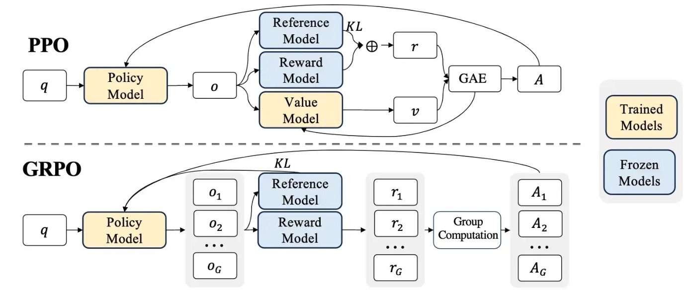

# GRPO与PPO算法对比分析

这张图可能大家看过无数次了，但是究竟如何理解？我们用更易于理解的语言来解释一下，看看GRPO究竟厉害在哪，为什么deepseek要使用这个算法来训练R1模型。

## 1. GRPO和PPO原理解析

### PPO原理（图上半部分）

PPO（Proximal Policy Optimization，近端策略优化）是一种广泛应用的强化学习算法，其工作流程如图所示：

1. **输入处理**：输入查询q（如问题或任务描述）被送入策略模型。这相当于向系统提出一个需要解决的问题。
2. **单一输出生成**：策略模型（Policy Model，通常是语言模型llm）生成单一输出o。系统基于当前策略生成一个解决方案。
3. **多重评估**：系统从多个角度评估这个解决方案
   - 参考模型计算KL散度（Kullback-Leibler divergence），确保新策略不会偏离太远。这可以理解为确保系统不会突然改变其行为方式来获得高reward；更通俗来讲，系统不会通过"作弊"的方式来获得高分，而是通过"努力"的方式来获得高分，符合一般的学习规律。
   - 奖励模型评估输出质量，给出奖励r。这相当于对解决方案o的质量进行评分。
   - 价值模型预测未来奖励的期望值v。这相当于预测该解决方案长期来看有多大价值。
4. **优势计算**：使用广义优势估计（GAE, Generalized Advantage Estimation）结合即时奖励r和价值估计v计算优势A。这一步计算当前解决方案比预期表现好多少。
5. **策略更新**：基于优势A更新策略模型。系统根据评估结果调整其策略，但不会做出过大改变。

### GRPO原理（图下半部分）

GRPO（Group Relative Policy Optimization，组相对策略优化）是PPO的一个变体，专为语言模型微调设计：

1. **输入处理**：与PPO相同，输入查询q被送入策略模型。
2. **多样性输出生成**：**策略模型为同一输入生成多个不同输出(o₁, o₂, ..., oG)。这是一个关键区别**，系统不再只生成一个解决方案，而是同时生成多个不同的解决方案。
3. **多重评估**：
   - 参考模型计算KL散度，同样确保策略不会偏离太远。
   - 奖励模型为每个输出评分，得到多个奖励值(r₁, r₂, ..., rG)。每个解决方案都获得独立的评分。
4. **组内优势计算**：通过"Group Computation"模块，基于同组内的奖励计算相对优势(A₁, A₂, ..., AG)。这一步直接比较同一组内不同解决方案的相对优劣，而不依赖于价值预测。
5. **策略更新**：基于相对优势和KL约束更新策略模型。系统学习产生更好的解决方案，避免产生较差的解决方案。

GRPO的关键创新是去除了价值模型，转而使用组内统计计算优势。这种方法不再需要预测未来奖励，而是直接比较当前生成的多个解决方案的相对质量。

## 2. GRPO相比PPO的创新点

从图中可以清晰看出GRPO的两大创新：

### 1. 多样性采样

PPO对每个输入只生成一个输出o，而GRPO生成多个输出(o₁, o₂, ..., oG)。这种多样性采样有几个明显优势：
- 更全面地探索解空间，相当于同时考虑多种可能的解决方案
- 更适合处理有多种正确答案的语言任务，特别是开放性问题

### 2. 组内相对优势计算vs价值网络

GRPO最关键的创新是用组内统计计算代替了价值网络，这就像班级考试中的两种评分方式：

**PPO的方式（使用价值网络）**：
- 就像老师预先设定一个标准分数（价值网络预测的v），然后根据学生实际得分（奖励r）与这个标准分数的差距来评价学生表现
- 需要额外训练一个"评分标准模型"（价值网络）来预测每个答案应该得多少分
- 如果这个"评分标准模型"不准确，会导致评价偏差

**GRPO的方式（组内相对优势）**：
- 就像直接计算班级平均分，然后看每个学生比平均分高多少或低多少
- 计算同组内奖励的均值和标准差，然后用(reward - group_mean) / group_std计算相对优势
- 不需要额外的"评分标准模型"，只需要比较组内不同答案的相对表现

**GRPO的优势**：
- 不需要训练额外的价值网络，节省了大量计算资源
- 对于不同难度的问题自动调整（难题大家都低分，简单题大家都高分，相对排名才重要）
- 避免了价值估计不准确带来的问题，训练更加稳定

从图中可以看到，GRPO用简单的"Group Computation"（组计算）模块替代了PPO中的"GAE"模块和"Value Model"，大大简化了算法架构，同时保持或提高了性能。

## 3. GRPO为什么消耗更少的资源

图中右侧标注了"Trained Models"（黄色，需要训练的模型）和"Frozen Models"（蓝色，固定不变的模型）。GRPO的核心优势在于去除了价值网络，带来以下好处：

| 优势类别 | GRPO相比PPO的具体优势 |
|---------|----------------------|
| **参数量减少** | 无需训练价值网络，训练参数量减少约50% |
| **计算资源节省** | 无需价值网络的前向和后向传播，计算量显著降低 |
| **超参数简化** | 无需调整价值网络相关超参数，如价值损失系数、GAE参数λ等 |
| **训练稳定性** | 避免价值估计误差带来的不稳定性，减少训练失败风险 |

总的来说，GRPO通过去除价值网络，在保持或提高性能的同时，显著降低了计算资源需求和实现复杂度，使大规模语言模型的强化学习训练更加高效和稳定。

## 总结

GRPO算法通过两个关键创新（多样性采样和组内相对优势计算代替价值网络）在保持PPO核心思想的同时，显著降低了资源消耗。
